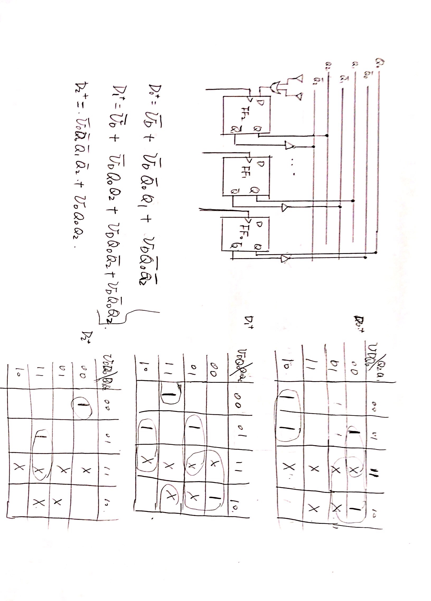

# 简答题
## 逻辑化简
逻辑表达式：OUT = [(XY)'(YZ)'(X'Z)']'  
X为1时，OUT = [Y'(YZ)']' = Y + YZ 所以Y=1，Z=0,1
## 组合与时序
组合电路是当前输入变量取值决定当前输出的无记忆元件，但是RS锁存器的输出并不只有当前输入决定，而是由当前输入和当前状态共同决定，所以不是组合电路。  
触发器除了置1，置0输入端外，还增加了一个触发信号输入端。只有当触发信号到来时，触发器才能按照锁存器相应的置0/1信号改变为相应的状态。
## 时间空间局部性
空间局部性：处理器访问存储器时，所访问的存储单元都趋于聚集在一个较小的连续单元区域中   
时间局部性：如果一个位置被访问了，那么它很有可能马上再次被访问。
## 时间空间局部性 
```C
int sumarr(int arr[N]) {
  int i, sum = 0;
  for (i = 0; i < N; i++) 
    sum += arr[i];
return sum;
```
时间局部性：i，sum
空间局部性：arr

# 分析计算题
## 时序电路+D触发器
触发器的初始状态都为0，输入信号与时钟上升沿同步变化。
1. 输出只由当前状态决定，所以是Moore型。
2.  状态的定义：FF0在低位，FF1在高位

现在状态 | 次态（In=0) | 次态（In=1）| 输出
----    |  -----      | ------ | -----
00 | 00 | 10 | 0
01 | 00 | 11 | 0
10 | 00 | 01 | 0
11 | 00 | 11 | 1

Tmin = 4 + 2 * 3 + 2 = 12ns

## MIPS代码
```asm
lw $s3, 0($s1) # s3 = M[s1]
lw $s4, 0($s1) # s4 = M[s1]
sll $s5, $s2, 2 # s5 = s2 * 4
add $s5, $s5, $s1 # 需要计算出截至时的地址！
addi $s1, $s1, 4 # s1 = s1 + 4
Loop:
lw $s6, 0($s1) # s6 = M[s1]
slt $s0, $s4, $s6 # s0 = (s4 < s6) ? 1 : 0
beq $s0, $0, Skip # if s0 = 0 : Skip!
add $s4, $s6, $0 # s4 = s6
Skip:
add $s3, $s3, $s6 # s3 = s3 + s6
addi $s1, $s1, 4 # s1 = s1 + 4
bne $s1, $s5, Loop # if s1 != s5: Loop
```
1. add $s5, $s5, $s1
2. R[s2]=200，则需要执行199次（可以考虑少的情况，再推广）
3. $s3 = sum(A0, A1, ..., An-1), $s4 = max(A0, A1, ..., An-1)
4. bne $s1, $s5, Loop  <=>  0001_0110_0011_0101_1111_1111_1110_0100 <=> 0x1635_FFE4

## 存储器
```C
void transpose(int dst[4][4], int src[4][4]) {
  int i, j;
  for (i = 0; i < 4; i++）
    for (j = 0; j < 4; j++)
      dst[j][i] = src[i][j]
}
```
矩阵按行优先存储，`sizof(int)=4`，src起始地址为0，dst起始地址为64。Cache块大小16字节，直接映射。读写都通过Cache。
1. Cache大小为32Bytes，所以一共只有两个块，一个块可以存4个整数。HitRate = 13 / 16

array | 1 | 2 | 3 | 4 | 5 | 6 | 7 | 8 
--- | --- | --- | --- | --- | --- | --- | --- | ---
src | miss | miss | hit | miss | miss | hit  | miss | hit
dst | miss | miss | miss | miss | miss | miss | miss | miss

2. Cache大小为128Bytes，所以一共有8个块。HitRate = 3/4

array | 1 | 2 | 3 | 4 | 5 | 6 | 7 | 8 | 9 | 10 | 11 | 12 | 13 | 14 | 15 | 16 
--- | --- | --- | --- | --- | --- | --- | --- | --- | --- | --- | --- | --- | --- | --- | --- | --- 
src | miss | hit  | hit  | hit  | miss | hit  | hit  | hit  | miss | hit  | hit  | hit  | miss | hit  | hit  | hit
dst | miss | miss | miss | miss | hit  | hit  | hit  | hit  | hit  | hit  | hit  | hit  | hit  | hit  | hit  | hit

## 流水线
```asm
add $s2, $s1, $s3
sub $s4, $s2, $s1
and $s5, $s1, $s2
sub $s6, $s2, $s4
add $s7, $s2, $s4
```

1->2:$s2  2->4:$s4
如果有完整的转发单元，则一次都不需要stall，9个周期。

第四条指令发生错误。

# 设计题
## 时序逻辑
上升沿触发的D触发器和非门，同步五进制的加减法计数器（000，010，011，100）
输入：**UD**：加减控制，1为加一计数，0为减一计数。和CLK   
！[状态图](./Photos/2015-3-1.1.jpg)

自启动判断：
UDQ0\Q1Q2 | 00 | 01 | 11 | 10
--- | ---| ---| --- | ---
00 | 
01 |
11 |
10 | 
