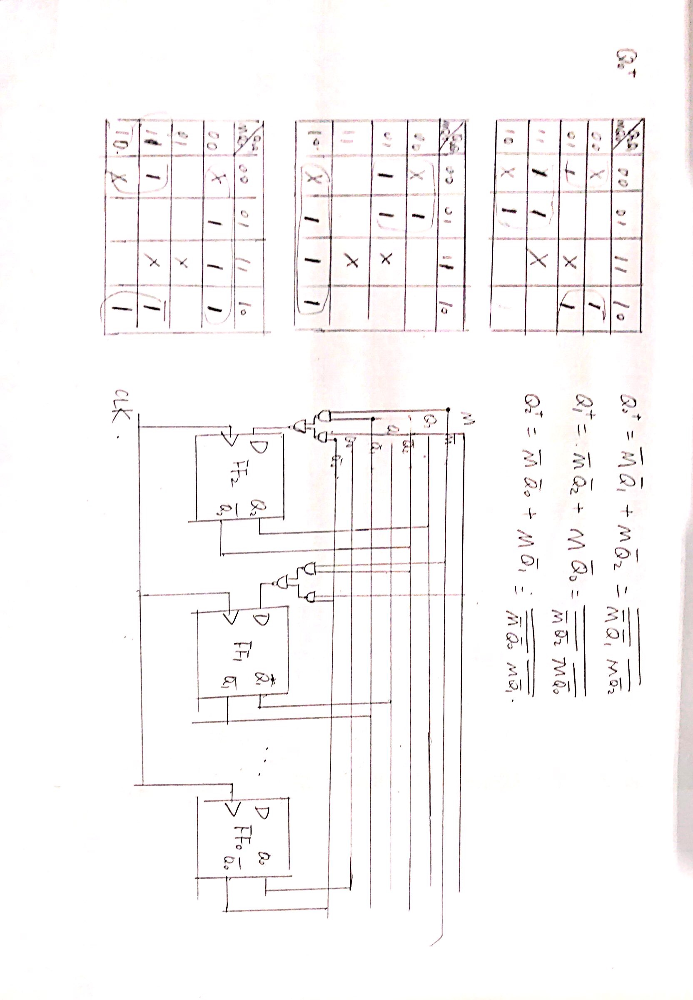

# 简答题
## 组合逻辑化简+多选器
F = A'C + AC' + ABC，四选一：用AC作为选择信号，分别选择[0, 1, 1, B]
## 格雷码
格雷码的状态转换按照仅有一位数字发生变化的原则改变。  
格雷码属于可靠性编码,是一种错误最小化的编码方式。
## 最小项
CA+CB = ABC + AB'C + A'BC = m7 + m5 + m3
## 单周期和流水线

阶段 | 时间
--- | ---
IF | 800
ID | 200
EX | 500
MEM | 800
WB | 200

单周期时钟周期为2500ps，流水线时钟周期为800ps
## Cache局部性原理
空间局部性：处理器访问存储器时，所访问的存储单元都趋于聚集在一个较小的连续单元区域中
时间局部性：如果一个位置被访问了，那么它很有可能马上再次被访问。

# 分析计算题
## 时序逻辑电路分析
看不清图

## 转发和停顿
```asm
sub $4, $2, $6
and $2, $4, $5
sub $3, $1, $2
add $5, $3, $2
sw $2, 6($5)
```

1. 不具备转发和停顿，则需要在1，2之间、2，3之间、3，4之间、4，5之间各插入两条NOP指令
2. 标出转发操作即连接线，注意线从两个阶段之间的寄存器出发，接至ALU之前，另外需要注意是ALU的哪一根线。

## MIPS
实现y=sgn(x)
```asm
sgn:
  slt $t0, $a0, $zero
  beq $t0, $zero, l1
  addi $v0, $zero, -1
  j exit
l1:
  slt $t0, $zero, $a0
  beq $t0, $zero, l2
  addi $v0, $zero, 1
  j exit
l2:
  add $v0, $zero, $zero
exit:
  jr $ra
```

1. x对应`$a0`,y对应`$v0`
5. `beq $t0, $zero, l1`对应的机器码：0001_0001_0000_0000_0000_0000_0000_1000

## 存储器+C代码
- A
```C
int a[2048], b[2048], c[2048], d[2048]
...
for(i = 0, i < 2048; i++) {
  a[i] = 0;
  b[i] = 0;
  c[i] = 0;
  d[i] = 0;
}
```
- B
```C
int a[2048], b[2048], c[2048], d[2048]
...
for(i = 0, i < 2048; i++) {
  a[i] = 0;
  b[i] = 0;
}
for(i = 0, i < 2048; i++) {
  c[i] = 0;
  d[i] = 0;
}
```

**16KB大小的Cache，2路组相联，块大小为64B，Cache替换算法为FIFO**

分析：16KB/64B = 2^8个块，2^7个组。一个块有16=2^4个字。2048=2^11
1. A:分析可知一直缺失，即缺失次数为4x2048=2^13次，缺失率为100%
2. B:分析可知只有在替换的时候会缺失，其他均不缺失。所以缺失次数为(1/16)x4x2048 = 512次，缺失率为 1 / 16

# 设计题
## 时序逻辑+D触发器
采用D触发器和两级最简与非门设计一个可控计数器，初始状态为 Q2 Q1 Q0 = 1 0 0
M=0: 100 -> 101 -> 001 -> 011 -> 010 -> 110
M=1: 100 -> 110 -> 010 -> 011 -> 001 -> 101


## 单周期CPU
1. 对于加法指令`add rd, rs, rt`，ALUSrc=0（选择rt），ALUOp=10（R型指令都为10），MemToReg=0（选择ALU输出）,RegWrite=1(需要写入）
2. ALU进行rs是否等于0的判断（和beq做的事情一样），之后再Reg写入数据端加一个多选器，在ALU输出和st寄存器和0之间选择，所以需要增加2位控制信号，高位由主控制器给出如果是crcc则为1，是其他原来的指令则为0。低位由ALU的新增加输出zero给出，这个输出定义为如果ALU两个输入相等则为1，否则为0。所以多选器的11选择rt，10选择0，0x选择ALU的原本输出。
